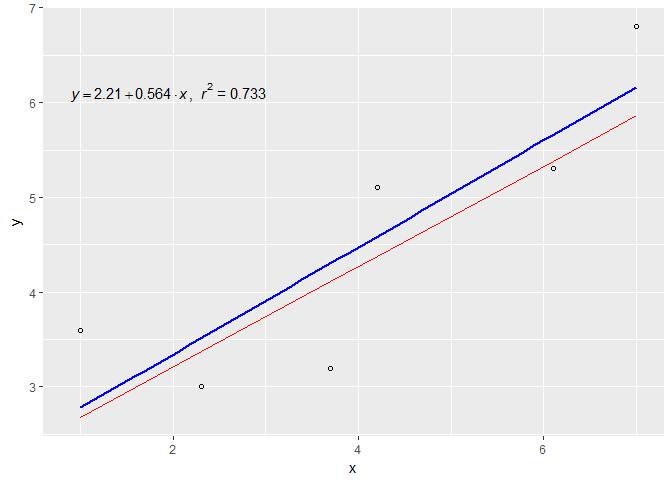

DATA609\_Assignment\_3\_4
================
Yun Mai
February 23, 2018

Choose to do two of the follows. Page 113: \#2 Page 121: \#2.a Page 127: \#10 Page 136: \#7 Page 146: \#5 Page 157: \#4 Page 169: \#11 Page 181: \#5

Choose to do two of the follows.
Page 191: \#3 Page 194: \#1 Page 201: \#4 Page 211: \#3 Page 221: \#2

Chapter 3. Model fitting
------------------------

3.1 Fitting Models to Data Graphically
--------------------------------------

Page 113: \#2

1.  The following table gives the elongation e in inches per inch (in./in.) for a given stress S on a steel wire measured in pounds per square inch (*l**b*/*i**n*.<sup>2</sup>). Test the model *e* = *c*<sub>1</sub>*S* by plotting the data. Estimate c1 graphically.

**Solution**

|             |     |   NA|   NA|   NA|   NA|   NA|   NA|   NA|   NA|   NA|   NA|
|-------------|-----|----:|----:|----:|----:|----:|----:|----:|----:|----:|----:|
| S (x 10^-3) | 5   |   10|   20|   30|   40|   50|   60|   70|   80|   90|  100|
| e (x 10^5)  | 0   |   19|   57|   94|  134|  173|  216|  256|  297|  343|  390|

Plot the data as follows:


By plotting the data, *C*<sub>1</sub> is estimated to be 0.245.

3.2 Analytic Methods of Model Fitting
-------------------------------------

Page 121: \#2.a

2.For each of the following data sets, formulate the mathematical model that minimizes the largest deviation between the data and the line y = ax+b. If a computer is available, solve for the estimates of a and b.

**Solution**

``` r
anly <- data.frame("x"=c(1.0, 2.3, 3.7, 4.2, 6.1, 7.0),"y"=c(3.6, 3.0, 3.2, 5.1, 5.3, 6.8))
anly <- as.data.frame(t(anly))
rownames(anly) <- c("x","y")
colnames(anly) <- ' '
#x = kable(elg, format="pandoc") %>%
#    kable_styling(bootstrap_options = c("striped", "hover", "condensed", "responsive"))
#cat(x[3:4], sep="\n")
kable(anly)
```

|     |     |   NA|   NA|   NA|   NA|   NA|
|-----|-----|----:|----:|----:|----:|----:|
| x   | 1.0 |  2.3|  3.7|  4.2|  6.1|  7.0|
| y   | 3.6 |  3.0|  3.2|  5.1|  5.3|  6.8|

``` r
#transpose the dataframe for plot
t_anly <- as.data.frame(t(anly))

# plot the data
#plot(t_anly[,2],t_anly[,1])
g1 <- ggplot(t_anly,aes(t_anly[,1],t_anly[,2]))
g2 <- g1 + geom_point(shape=1) 
g3 <- g2 + geom_smooth(method=lm, se=FALSE)
g4 <- g3 + xlab(colnames(t_anly[1]))+ylab(colnames(t_elg[2]))
g4 + stat_smooth_func(geom="text",method="lm",hjust=0,parse=TRUE) 
```


residuals *r*<sub>*i*</sub> = *y*<sub>*i*</sub> − *f*(*x*<sub>*i*</sub>).r represents the largest absolute value of these residuals, we need to find out the minimize r.

Subject to:

r-(3.6-(a+b)) &gt;= 0

r+(3.6-(a+b)) &gt;= 0

r-(3-(2.3a+b)) &gt;= 0

r+(3-(2.3a+b)) &gt;= 0

r-(3.2-(3.7a+b)) &gt;= 0

r+(3.2-(3.7a+b)) &gt;= 0

r-(5.1-(4.2a+b)) &gt;= 0

r+(5.1-(4.2a+b)) &gt;= 0

r-(5.3-(6.1a+b)) &gt;= 0

r+(5.3-(6.1a+b)) &gt;= 0

r-(6.8-(7a+b)) &gt;= 0

r+(6.8-(7a+b)) &gt;= 0

These inequations could be rewritten as follows:

-r-(a\*x1+b) &lt;= -y1

-r+(a\*x1+b) &lt;= y1

-r-(a\*x2+b) &lt;= -y2

-r+(a\*x2+b) &lt;= y2

-r-(a\*x3+b) &lt;= -y3

-r+(a\*x3+b) &lt;= y3

-r-(a\*x4+b) &lt;= -y4

-r+(a\*x4+b) &lt;= y4

-r-(a\*x5+b) &lt;= -y5

-r+(a\*x5+b) &lt;= y5

-r-(a\*x6+b) &lt;= -y6

-r+(a\*x6+b) &lt;= y6

$$
\\begin{equation}
\\begin{bmatrix}
    -1       & -x\_{1} & -1 \\\\
    -1       & x\_{1} &  1 \\\\
    -1       & -x\_{2} & -1 \\\\
    -1       & x\_{2} &  1 \\\\
    \\cdots \\\\
    -1       & x\_{6} & -1 \\\\
    -1       & x\_{6} & 1
\\end{bmatrix}
\\begin{bmatrix}
    r \\\\
    a\\\\
    b
\\end{bmatrix}
=
\\begin{bmatrix}
    -y\_{1}  \\\\
    y\_{1}  \\\\
    y\_{2}  \\\\
    -y\_{2}  \\\\
    \\cdots \\\\
    -y\_{6} \\\\
    y\_{6}
\\end{bmatrix}
\\end{equation}
$$
 let:
$$
\\begin{equation}
{f} = 
\\begin{pmatrix}
  1   \\\\
  0  \\\\
  0
  \\end{pmatrix}
\\end{equation}
$$
 and
$$
\\begin{equation}
{x} = \\begin{pmatrix}
  r   \\\\
  a  \\\\
  b
  \\end{pmatrix}
\\end{equation}
$$

constraints : Ax &lt;= c

objective function:*m**a**x* *f*<sup>*T*</sup>*x*

``` r
suppressMessages(suppressWarnings(library(linprog)))  
# form c vector 
cvec <- c(1, 0, 0)

# form b vector 
bvec <- list(rep(0,12))
for(i in 1:nrow(t_anly) ){
  bvec[[2*i-1]] <- (rep(t_anly$y[i],2)*c(-1,1))[1]
  bvec[[2*i]] <- (rep(t_anly$y[i],2)*c(-1,1))[2]
  j=i+1
}
bvec <- as.numeric(bvec)

# form matrix A
A_x <- as.list(rep(0,12))
for(i in 1:nrow(t_anly) ){
  A_x[2*i-1] <- (rep(t_anly$x[i],2)*c(-1,1))[1]
  A_x[2*i] <- (rep(t_anly$x[i],2)*c(-1,1))[2]
}
A_x <- as.numeric(A_x)

A <- as.matrix(data.frame(rep(-1,12), A_x,rep(c(-1,1),6)))

res <- solveLP(cvec,bvec,A,maximum=FALSE)
res 
```

    ## 
    ## 
    ## Results of Linear Programming / Linear Optimization
    ## 
    ## Objective function (Minimum): 0.92 
    ## 
    ## Iterations in phase 1: 7
    ## Iterations in phase 2: 1
    ## Solution
    ##        opt
    ## 1 0.920000
    ## 2 0.533333
    ## 3 2.146667
    ## 
    ## Basic Variables
    ##           opt
    ## 1    0.920000
    ## 2    0.533333
    ## 3    2.146667
    ## S 2  1.840000
    ## S 3  1.293333
    ## S 4  0.546667
    ## S 5  1.840000
    ## S 7  0.206667
    ## S 8  1.633333
    ## S 9  1.020000
    ## S 10 0.820000
    ## S 12 1.840000
    ## 
    ## Constraints
    ##      actual dir bvec     free  dual dual.reg
    ## 1  -3.60000  <= -3.6 0.000000 0.275 2.342857
    ## 2   1.76000  <=  3.6 1.840000 0.000 1.840000
    ## 3  -4.29333  <= -3.0 1.293333 0.000 1.293333
    ## 4   2.45333  <=  3.0 0.546667 0.000 0.546667
    ## 5  -5.04000  <= -3.2 1.840000 0.000 1.840000
    ## 6   3.20000  <=  3.2 0.000000 0.500 4.293333
    ## 7  -5.30667  <= -5.1 0.206667 0.000 0.206667
    ## 8   3.46667  <=  5.1 1.633333 0.000 1.633333
    ## 9  -6.32000  <= -5.3 1.020000 0.000 1.020000
    ## 10  4.48000  <=  5.3 0.820000 0.000 0.820000
    ## 11 -6.80000  <= -6.8 0.000000 0.225 2.050000
    ## 12  4.96000  <=  6.8 1.840000 0.000 1.840000
    ## 
    ## All Variables (including slack variables)
    ##           opt cvec     min.c    max.c  marg marg.reg
    ## 1    0.920000    1 -2.000000       NA    NA       NA
    ## 2    0.533333    0 -1.350000 1.650000    NA       NA
    ## 3    2.146667    0 -0.308411 0.574468    NA       NA
    ## S 1  0.000000    0 -0.275000      Inf 0.275  2.34286
    ## S 2  1.840000    0 -0.500000 0.611111 0.000       NA
    ## S 3  1.293333    0 -0.351064      Inf 0.000       NA
    ## S 4  0.546667    0 -0.500000 1.178571 0.000       NA
    ## S 5  1.840000    0 -0.500000      Inf 0.000       NA
    ## S 6  0.000000    0 -0.500000      Inf 0.500  4.29333
    ## S 7  0.206667    0 -0.421875      Inf 0.000       NA
    ## S 8  1.633333    0 -0.500000 2.700000 0.000       NA
    ## S 9  1.020000    0 -0.264706      Inf 0.000       NA
    ## S 10 0.820000    0 -0.500000 0.562500 0.000       NA
    ## S 11 0.000000    0 -0.225000      Inf 0.225  2.05000
    ## S 12 1.840000    0 -0.500000 0.409091 0.000       NA

The formula is: y = 0.53x+2.15. The minimum of the largest deviation between the data and the line y = ax+b is r = 0.92.

``` r
# calculate the estimated y by new formula y=4.9x.
t_anly$y_new <- 0.53*t_anly$x+2.15
  
# plot the data
#plot(t_anly[,2],t_anly[,1])
g1 <- ggplot(t_anly,aes(x=t_anly[,1]))
g2 <- g1 + geom_point(aes(y=t_anly[,2]),shape=1) 
g3 <- g2 + geom_smooth(aes(y=t_anly[,2]),method=lm, se=FALSE,colour='blue')
g4 <- g3 + xlab(colnames(t_anly)[1])+ylab(colnames(t_anly)[2])
g5 <- g4 + stat_smooth_func(aes(y=t_anly[,2]),geom="text",method="lm",hjust=0,parse=TRUE) 
g5 + geom_line(aes(y=t_anly[,3]),colour='red') 
```



As shown in the figure above, the formula deduced from function stat\_smooth\_func() (red line) is different but close to the formula derived from the linear regression model(blue line). They must used differetnt criteria to fit the model.

Chapter 5. Simulation Modeling
------------------------------

5.2 Generating Ramdon numbers
-----------------------------

Page 191: \#3

1.  Using Monte Carlo simulation, write an algorithm to calculate an approximation to *π* by considering the number of random points selected inside the quarter circle

*Q* : *x*<sup>2</sup> + *y*<sup>2</sup> = 1; *x* ≥ 0, *y* ≥ 0

where the quarter circle is taken to be inside the square

*S* : 0 ≤ *x* ≤ 1*a**n**d*0 ≤ *y* ≤ 1

Use the equation *π*/4 = *a**r**e**a**Q*/*a**r**e**a**S*.

**Solution**

We can simulate x and y values with constrains *x* ≥ 0, *y* ≥ 0.When the simulated pair of values satisfies the inequality *x*2 + *y*2 ≤ 1, then the points inside the quarter circle increase one. We apporcimate ??/4 by deviding the number of points simulated in the quarter circle by the total number of simulated points.

``` r
#set different sample sizes for simulation
sim_t <- c(100,200,500,1000,10000,100000)
tb_pi <- data.frame('sample size'=rep(0,length(sim_t)),'est_pi'=rep(0,length(sim_t)),'diff'=rep(0,length(sim_t)))

set.seed(100)
for (i in 1:length(sim_t)){
  n <- sim_t[i]
  #generate ramdon points
  x <- runif(n)
  y <- runif(n)
  # count the points in the quarter circle
  est <- (sum (x^2 + y^2 <=1)/n)*4
  tb_pi[i,'sample size'] <- n
  tb_pi[i,'est_pi'] <- round(est,4)
  tb_pi[i,'diff'] <- round((tb_pi$est_pi[i] - pi),4)
}

kable(tb_pi)
```

|  sample.size|  est\_pi|     diff|  sample size|
|------------:|--------:|--------:|------------:|
|            0|   3.0000|  -0.1416|        1e+02|
|            0|   3.0600|  -0.0816|        2e+02|
|            0|   3.0560|  -0.0856|        5e+02|
|            0|   3.2200|   0.0784|        1e+03|
|            0|   3.1620|   0.0204|        1e+04|
|            0|   3.1455|   0.0039|        1e+05|

Page 194, \# 1

1.  Use the middle-square method to generate

<!-- -->

1.  10 random numbers using x0 = 1009.
2.  20 random numbers using x0 = 653217.
3.  15 random numbers using x0 = 3043.
4.  Comment about the results of each sequence. Was there cycling? Did each sequence degenerate rapidly?

**Solution**

``` r
suppressMessages(suppressWarnings(library(stringr)))
new_num <- 0
sqn <- list()
rand_gen <- function(n, x0){
  for (i in 1:(n-1)){
    if (new_num == 0){
      #1. Start with a four-digit number x0, called the seed.
      x <- x0
    }else{
      # or start with a four-digit number from last run
      x <- new_num
    }
    
    #2. Square it to obtain an eight-digit number (add a leading zero if necessary).
    sq <- as.character(x^2)
    # put 0 at the begining square product is odd-digit number
    if (nchar(sq) %%2 == 1){
      sq <- paste0 ("0",sq)
    }
    
    #3. Take the middle four digits as the next random number.
    new_num_str <- substr(sq,nchar(sq)/2-1,nchar(sq)/2+2) 
    new_num <- as.numeric(new_num_str)
    sqn <- append(sqn,new_num_str)
  }
  sqn <- as.data.frame(c(as.character(x0),sqn))
  colnames(sqn) <- seq(n)
  sqn
}
```

1.  10 random numbers using x0 = 1009.

``` r
rand_gen(10,1009)
```

    ##      1    2    3    4    5    6    7    8    9   10
    ## 1 1009 0180 3240 4976 7605 8360 8896 1388 9265 8402

1.  20 random numbers using x0 = 653217.

``` r
(rand_gen(20,653217))
```

    ##        1    2    3    4    5    6    7    8    9   10   11   12   13   14
    ## 1 653217 9244 4515 3852 8379 2076 3097 5914 9753 1210 4641 5388 0305 9302
    ##     15   16   17   18   19   20
    ## 1 5272 7939 0277 7672 8595 8740

1.  15 random numbers using x0 = 3043.

``` r
(rand_gen(15,3043))
```

    ##      1    2    3    4    5    6    7    8    9   10   11   12   13   14
    ## 1 3043 2598 7496 1900 6100 2100 4100 8100 6100 2100 4100 8100 6100 2100
    ##     15
    ## 1 4100

1.  Comment about the results of each sequence. Was there cycling? Did each sequence degenerate rapidly?

For a, there is no cycling. Sometimes the sequence is degenerating rapidly such as from 1009 to 180 but there is no trend showing the sequence is degenerating.

For b, there is no cycling. Rapid degeneration only shows between the first number (653217) and the second number (9244) in the first 20 draws.

For c, a sequence of 4 numbers(6100,2100,4100,8100) begins to cycle from the 5th value. No rapid degeneration observed.
