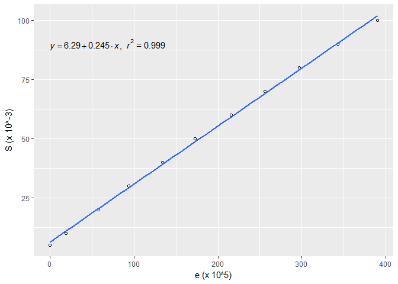
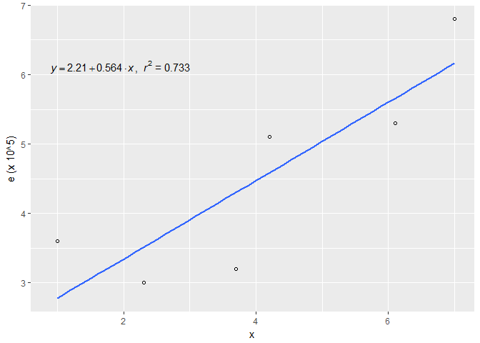

DATA609\_Assignment\_3\_4
================
Yun Mai
February 23, 2018

Choose to do two of the follows. Page 113: \#2 Page 121: \#2.a Page 127: \#10 Page 136: \#7 Page 146: \#5 Page 157: \#4 Page 169: \#11 Page 181: \#5

Choose to do two of the follows.
Page 191: \#3 Page 194: \#1 Page 201: \#4 Page 211: \#3 Page 221: \#2

Chapter 3. Model fitting
------------------------

3.1 Fitting Models to Data Graphically
--------------------------------------

Page 113: \#2

1.  The following table gives the elongation e in inches per inch (in./in.) for a given stress S on a steel wire measured in pounds per square inch (*l**b*/*i**n*.<sup>2</sup>). Test the model *e* = *c*<sub>1</sub>*S* by plotting the data. Estimate c1 graphically.

    |             |   NA|   NA|   NA|   NA|   NA|   NA|   NA|   NA|   NA|   NA|     |
    |-------------|----:|----:|----:|----:|----:|----:|----:|----:|----:|----:|-----|
    | S (x 10^-3) |    5|   10|   20|   30|   40|   50|   60|   70|   80|   90| 100 |
    | e (x 10^5)  |    0|   19|   57|   94|  134|  173|  216|  256|  297|  343| 390 |

Plot the data as follows:



By plotting the data, *C*<sub>1</sub> is estimated to be 0.245.

3.2 Analytic Methods of Model Fitting
-------------------------------------

Page 121: \#2.a

2.For each of the following data sets, formulate the mathematical model that minimizes the largest deviation between the data and the line y = ax+b. If a computer is available, solve for the estimates of a and b.

``` r
anly <- data.frame("x"=c(1.0, 2.3, 3.7, 4.2, 6.1, 7.0),"y"=c(3.6, 3.0, 3.2, 5.1, 5.3, 6.8))
anly <- as.data.frame(t(anly))
rownames(elg) <- c("x","y")
colnames(elg) <- ' '
#x = kable(elg, format="pandoc") %>%
#    kable_styling(bootstrap_options = c("striped", "hover", "condensed", "responsive"))
#cat(x[3:4], sep="\n")
kable(anly)
```

|     |   V1|   V2|   V3|   V4|   V5|   V6|
|-----|----:|----:|----:|----:|----:|----:|
| x   |  1.0|  2.3|  3.7|  4.2|  6.1|  7.0|
| y   |  3.6|  3.0|  3.2|  5.1|  5.3|  6.8|

``` r
#transpose the dataframe for plot
t_anly <- as.data.frame(t(anly))

# plot the data
#plot(t_anly[,2],t_anly[,1])
g1 <- ggplot(t_anly,aes(t_anly[,1],t_anly[,2]))
g2 <- g1 + geom_point(shape=1) 
g3 <- g2 + geom_smooth(method=lm, se=FALSE)
g4 <- g3 + xlab(colnames(t_anly[1]))+ylab(colnames(t_elg[2]))
g4 + stat_smooth_func(geom="text",method="lm",hjust=0,parse=TRUE) 
```



residuals *r*<sub>*i*</sub> = *y*<sub>*i*</sub> − *f*(*x*<sub>*i*</sub>).r represents the largest absolute value of these residuals, we need to find out the minimize r.

Subject to:

r-(3.6-(a+b)) &gt;= 0

r+(3.6-(a+b)) &gt;= 0

r-(3-(2.3a+b)) &gt;= 0

r+(3-(2.3a+b)) &gt;= 0

r-(3.2-(3.7a+b)) &gt;= 0

r+(3.2-(3.7a+b)) &gt;= 0

r-(5.1-(4.2a+b)) &gt;= 0

r+(5.1-(4.2a+b)) &gt;= 0

r-(5.3-(6.1a+b)) &gt;= 0

r+(5.3-(6.1a+b)) &gt;= 0

r-(6.8-(7a+b)) &gt;= 0

r+(6.8-(7a+b)) &gt;= 0

These inequations could be rewritten as follows:

-r-(a\*x1+b) &lt;= -y1

-r+(a\*x1+b) &lt;= y1

-r-(a\*x2+b) &lt;= -y2

-r+(a\*x2+b) &lt;= y2

-r-(a\*x3+b) &lt;= -y3

-r+(a\*x3+b) &lt;= y3

-r-(a\*x4+b) &lt;= -y4

-r+(a\*x4+b) &lt;= y4

-r-(a\*x5+b) &lt;= -y5

-r+(a\*x5+b) &lt;= y5

-r-(a\*x6+b) &lt;= -y6

-r+(a\*x6+b) &lt;= y6

$$
\\begin{bmatrix}
    -1       & -x\_{1} & -1 \\\\
    -1       & x\_{1} &  1 \\\\
    -1       & -x\_{2} & -1 \\\\
    -1       & x\_{2} &  1 \\\\
    \\cdots \\\\
    -1       & x\_{6} & -1 \\\\
    -1       & x\_{6} & 1
\\end{bmatrix}
\\begin{bmatrix}
    r \\\\
    a\\\\
    b
\\end{bmatrix}
=
\\begin{bmatrix}
    -y\_{1}  \\\\
    y\_{1}  \\\\
    y\_{2}  \\\\
    -y\_{2}  \\\\
    \\cdots \\\\
    -y\_{6} \\\\
    y\_{6}
\\end{bmatrix}
$$

let:
constraints : Ax &lt;= c

objective:*m**a**x* *f*<sup>*T*</sup>*x*

    ## 
    ## 
    ## Results of Linear Programming / Linear Optimization
    ## 
    ## Objective function (Minimum): 1.9 
    ## 
    ## Solution
    ##   opt
    ## 1 1.9
    ## 2 4.9
    ## 3 0.0

The formula is: y = 4.9x. The minimum of the largest deviation between the data and the line y = ax+b is r = 1.9.

Chapter 5. Simulation Modeling
------------------------------

5.2 Generating Ramdon numbers
-----------------------------

Page 191: \#3

1.  Using Monte Carlo simulation, write an algorithm to calculate an approximation to *π* by considering the number of random points selected inside the quarter circle

*Q* : *x*<sup>2</sup> + *y*<sup>2</sup> = 1; *x* ≥ 0, *y* ≥ 0

where the quarter circle is taken to be inside the square

*S* : 0 ≤ *x* ≤ 1*a**n**d*0 ≤ *y* ≤ 1

Use the equation *π*/4 = *a**r**e**a**Q*/*a**r**e**a**S*.

#### Solution

We can simulate x and y values with constrains *x* ≥ 0, *y* ≥ 0.When the simulated pair of values satisfies the inequality *x*2 + *y*2 ≤ 1, then the points inside the quarter circle increase one. We apporcimate ??/4 by deviding the number of points simulated in the quarter circle by the total number of simulated points.

``` r
#set different sample sizes for simulation
sim_t <- c(100,200,500,1000,10000,100000)
tb_pi <- data.frame('sample size'=rep(0,length(sim_t)),'est_pi'=rep(0,length(sim_t)),'diff'=rep(0,length(sim_t)))

set.seed(100)
for (i in 1:length(sim_t)){
  n <- sim_t[i]
  #generate ramdon points
  x <- runif(n)
  y <- runif(n)
  # count the points in the quarter circle
  est <- (sum (x^2 + y^2 <=1)/n)*4
  tb_pi[i,'sample size'] <- n
  tb_pi[i,'est_pi'] <- round(est,4)
  tb_pi[i,'diff'] <- round((tb_pi$est_pi[i] - pi),4)
}

kable(tb_pi)
```

|  sample.size|  est\_pi|     diff|  sample size|
|------------:|--------:|--------:|------------:|
|            0|   3.0000|  -0.1416|        1e+02|
|            0|   3.0600|  -0.0816|        2e+02|
|            0|   3.0560|  -0.0856|        5e+02|
|            0|   3.2200|   0.0784|        1e+03|
|            0|   3.1620|   0.0204|        1e+04|
|            0|   3.1455|   0.0039|        1e+05|

Page 194, \# 1

1.  Use the middle-square method to generate

<!-- -->

1.  10 random numbers using x0 = 1009.
2.  20 random numbers using x0 = 653217.
3.  15 random numbers using x0 = 3043.
4.  Comment about the results of each sequence. Was there cycling? Did each sequence degenerate rapidly?

``` r
suppressMessages(suppressWarnings(library(stringr)))
rand_gen <- function(n, x0){
  
  #1. Start with a four-digit number x0, called the seed.
  x <- x0
  
  #2. Square it to obtain an eight-digit number (add a leading zero if necessary).
  num_dig <- (nchar(x) + nchar(x) %% 2) * 2
  
  #3. Take the middle four digits as the next random number.
  mid_sq <- function(z){
    
    # square number, add leading zeros if appropriate
    z <- str_sub(paste(c(replicate(num_dig,"0"),z^2), collapse = ""),-num_dig)
    
    
    as.integer(str_sub(z,start = 1 + num_dig/4 , end = num_dig - num_dig/4))
  }
  
  # iterate 
  if (n > 1) {
    for (i in 2:n) {
      x <- append(x, mid_sq(x[length(x)]))
    }
  }
  x
}
```

1.  10 random numbers using x0 = 1009.

``` r
(rand_gen(10,1009))
```

    ##  [1] 1009  180  324 1049 1004   80   64   40   16    2

1.  20 random numbers using x0 = 653217.

``` r
(rand_gen(20,653217))
```

    ##  [1] 653217 692449 485617 823870 761776 302674 611550 993402 847533 312186
    ## [11] 460098 690169 333248  54229 940784  74534 555317 376970 106380 316704

1.  15 random numbers using x0 = 3043.

``` r
(rand_gen(15,3034))
```

    ##  [1] 3034 2051 2066 2683 1984 9362 6470 8609 1148 3179 1060 1236 5276 8361
    ## [15] 9063

1.  Comment about the results of each sequence. Was there cycling? Did each sequence degenerate rapidly?

For a, No cycling, but the sequence is degenerating rapidly.

For b, No obvious cycling or degeneration in the first 20 draws.

For c: The sequence of 4 numbers begins to cycle at the 9th value.No rapid degeneration observed.
