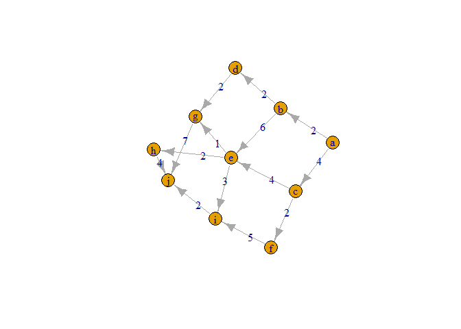

YunMai\_hw\_7\_8
================
Yun Mai
March 24, 2018

Chapter 8 Modeling Using Graph Theory
-------------------------------------

### 8.4 Using Graph Models to Solve Problems

Page 331: \#1 1. Find a shortest path from node a to node j in the graph in Figure 8.33 with edge weights shown on the graph.

**Solution**

``` r
suppressMessages(suppressWarnings(library(igraph)))

edgelist <- rbind( c('a','b',2), c('a','c',4),c('b','e',7),c('b','d',2),c('c','f',2), c('c','e',4), c('d','g',2), c('e','i',3), c('e','h',2), c('e','g',1), c('f','i',6), c('h','j',4), c('i','j',2), c('g','j',8))

colnames(edgelist) <- c("from", "to", "capacity")
edgelist <- as.data.frame(edgelist)

g <- graph_from_edgelist(as.matrix(edgelist[,c('from','to')]))

E(g)$capacity <- edgelist$capacity
edgelist$capacity
```

    ##  [1] 2 4 7 2 2 4 2 3 2 1 6 4 2 8
    ## Levels: 1 2 3 4 6 7 8

``` r
E(g)$capacity
```

    ##  [1] 2 4 6 2 2 4 2 3 2 1 5 4 2 7

``` r
plot(g, edge.label = E(g)$capacity)
```



``` r
g1 <- graph_from_data_frame(as.matrix(edgelist))

get.shortest.paths(g1, from=V(g1)[1], to=V(g1)[10], mode = c("all"), weights = edgelist$capacity)
```

    ## $vpath
    ## $vpath[[1]]
    ## + 7/10 vertices, named, from cae6457:
    ## [1] a b d g e i j
    ## 
    ## 
    ## $epath
    ## NULL
    ## 
    ## $predecessors
    ## NULL
    ## 
    ## $inbound_edges
    ## NULL

``` r
distMatrix <- shortest.paths(g1, v=V(g1), mode = c("all"),
      weights = edgelist$capacity)
distMatrix["a", "j"]
```

    ## [1] 12

So the shortest path from node a to node j is 12. This result is consistent to what I got by using the Dijkstra's Shortest-Path Algorithm.

Page 331: \#3

1.  Use our maximum-flow algorithm to find the maximum flow from s to t in the graph of Figure 8.31.

Maximum-Flow Algorithm:

**Input** A directed graph G =V(G) A(G)// with with a source vertex s and a sink vertex t and a finite flow capacity uij for each arc *i**j*2*A*(*G*). Let *u*<sub>*i**j*</sub> = 0 for all *i**j* ∈ *A*(*G*).

**Output** The maximum flow from s to t in G.

**Step 0** Set the current ow to zero: fc 0.

**Step 1** Find a directed path from s to t in the current graph. If there is no such path, stop. The maximum flow from s to t in G is fc.

**Step 2** Compute umin, the minimum capacity in the current graph of all the arcs in the directed path.

**Step 3** For each arc ij in the directed path, update the residual capacity in the current graph: $u\_{ij} u\_{ij}- u\_min $. Also update "reverse"" arc capacities: *u*<sub>*j**i*</sub> ← *u*<sub>*j**i*</sub> + *u*<sub>*m*</sub>*i**n*.

**Step 4** Set *f*<sub>*c*</sub> ← *f*<sub>*c*</sub> + *u*<sub>*m*</sub>*i**n* and return to Step 1.

``` r
#plot Figure 8.31
edgelist <- rbind( c('s','x1'),c('x1','y1'),c('y1','t'), 
                   c('s','x1'),c('x1','y2'),c('y2','t'),
                   c('s','x1'),c('x1','y4'),c('y4','t'),
                   c('s','x1'),c('x1','y5'),c('y5','t'),
                   c('s','x2'),c('x2','y3'),c('y3','t'),
                   c('s','x2'),c('x2','y6'),c('y6','t'),
                   c('s','x3'),c('x3','y3'),c('y3','t'),
                   c('s','x4'),c('x4','y1'),c('y1','t'),
                   c('s','x4'),c('x4','y3'),c('y3','t'))

colnames(edgelist) <- c("from", "to")
edgelist <- as.data.frame(edgelist)

g <- graph_from_edgelist(as.matrix(edgelist[,c('from','to')]))

V(g)$x <- c(1,2,3,4,3,3,3,2,3,3,2,2)
V(g)$y <- c(4,6,6,4,5,3,2,4.5,4,1,3.5,1)
V(g)$color <- c('red', 'steelblue', 'green', 'pink', 'green', 'green', 'green','steelblue', 'green','green','steelblue','steelblue')
plot(g)
```


``` r
max_flow(g, source=V(g)[1], target=V(g)[4])
```

    ## $value
    ## [1] 9
    ## 
    ## $flow
    ##  [1] 1 1 1 1 1 1 1 1 1 1 1 1 1 1 1 1 1 1 1 1 1 1 1 1 1 1 1
    ## 
    ## $cut
    ## [1]  3  6  9 12 15 18 21 24 27
    ## 
    ## $partition1
    ## + 11/12 vertices, named, from caff738:
    ##  [1] s  x1 y1 y2 y4 y5 x2 y3 y6 x3 x4
    ## 
    ## $partition2
    ## + 1/12 vertex, named, from caff738:
    ## [1] t
    ## 
    ## $stats
    ## $stats$nopush
    ## [1] 18
    ## 
    ## $stats$norelabel
    ## [1] 0
    ## 
    ## $stats$nogap
    ## [1] 0
    ## 
    ## $stats$nogapnodes
    ## [1] 0
    ## 
    ## $stats$nobfs
    ## [1] 1

The maximum flow from s to t in the graph of Figure 8.31 is 9.

Chapter 9. Modeling With Decision Theory
----------------------------------------

### 9.1 Probability and Expected Value

Page 347: \#4

1.  We have engaged in a business venture. Assume the probability of success is P(s)= 2/5; further assume that if we are successful we make $55,000, and if we are unsuccessful we lose $1750. Find the expected value of the business venture.

*E*(*v**a**l**u**e*)=*P*(*s*)×55000 + (1 − *P*(*s*)) × 1750

``` r
Ps <- 2/5
(E_v <- Ps* 55000 + (1-Ps)* 1750)
```

    ## [1] 23050

The expected value of the business venture is $23,050.

### 9.3 Sequential Decisions and Conditional Probabilities

Page 364: \#3

1.  A big private oil company must decide whether to drill in the Gulf of Mexico. It costs $1 million to drill, and if oil is found its value is estimated at $6 million. At present, the oil company believes that there is a 45% chance that oil is present. Before drilling begins, the big private oil company can hire a geologist for $100,000 to obtain samples and test for oil. There is only about a 60% chance that the geologist will issue a favorable report. Given that the geologist does issue a favorable report, there is an 85% chance that there is oil. Given an unfavorable report, there is a 22% chance that there is oil. Determine what the big private oil company should do.

``` r
library(data.tree)

oil <- Node$new("oil campany")
  geologist_research <- oil$AddChild("geologist_research")
  favorable_report <- geologist_research$AddChild("Favorable_report")
    true1 <- favorable_report$AddChild("True")
    false1 <- favorable_report$AddChild("False")
  unfavorable_report <- geologist_research$AddChild("Unfavorable_report")
    true2 <- unfavorable_report$AddChild("True")
    false2 <- unfavorable_report$AddChild("False")
  no_geologist_research <- oil$AddChild("No_geologist_research")
    true3 <- no_geologist_research$AddChild("True")
    false3 <- no_geologist_research$AddChild("False")


favorable_report$p <- 0.6
true1$p <- 0.85
false1$p <- 0.15
unfavorable_report$p  <- 0.4
true2$p <- 0.22
false2$p <- 0.78
true2$p <- 0.45
false2$p <- 0.55

true1$cost <- 10^6*0.6*0.85
false1$cost <- 10^6*0.6*0.15
true2$cost <- 10^6*0.4*0.22
false2$cost <- 10^6*0.4*0.78
true3$cost <- 10^6*0.45
false3$cost <- 10^6*0.55

true1$profit <- 6*10^6*0.6*0.85
true2$profit <- 6*10^6*0.4*0.22
true3$profit <- 6*10^6*0.45

print(oil,"p","cost","profit")
```

    ##                     levelName    p   cost  profit
    ## 1  oil campany                  NA     NA      NA
    ## 2   ¦--geologist_research       NA     NA      NA
    ## 3   ¦   ¦--Favorable_report   0.60     NA      NA
    ## 4   ¦   ¦   ¦--True           0.85 510000 3060000
    ## 5   ¦   ¦   °--False          0.15  90000      NA
    ## 6   ¦   °--Unfavorable_report 0.40     NA      NA
    ## 7   ¦       ¦--True           0.45  88000  528000
    ## 8   ¦       °--False          0.55 312000      NA
    ## 9   °--No_geologist_research    NA     NA      NA
    ## 10      ¦--True                 NA 450000 2700000
    ## 11      °--False                NA 550000      NA

``` r
#plot(oil)
```

``` r
(E_pro <- ((0.6*0.85)+(0.4*0.22)+0.45)*6*10^6-10^6*2-10^5)
```

    ## [1] 4188000

The expected profit of having the geolotist to investigate and drilling in the Gulf of Mexico will be $4,188,000. If $4,188,000 is acceptable, the big private oil company should go ahead to drill in the Gulf of Mexico.
