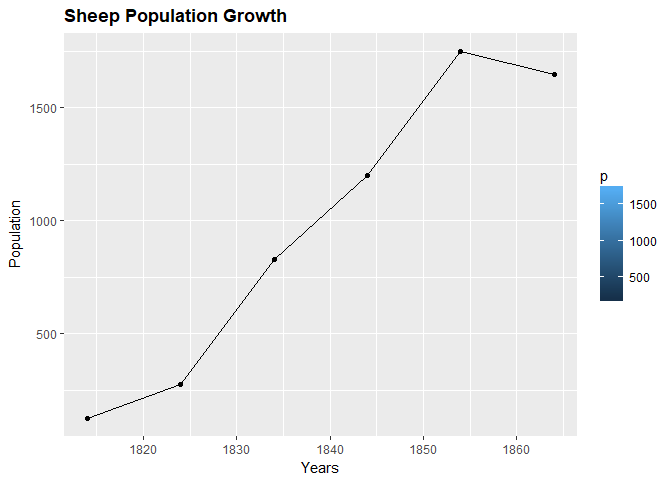
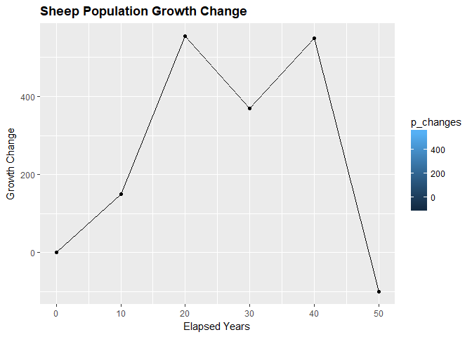
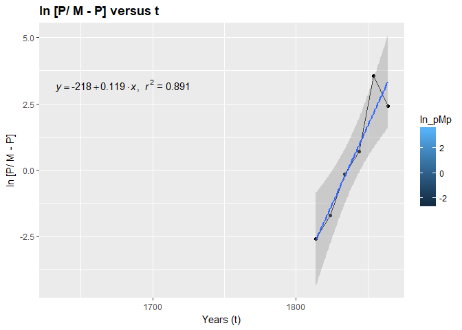

YunMai\_hw9\_10
================
Yun Mai
April 10, 2018

``` r
suppressMessages(suppressWarnings(library(knitr)))
suppressMessages(suppressWarnings(library(ggplot2)))
suppressMessages(suppressWarnings(library(kableExtra)))
suppressMessages(suppressWarnings(library(formattable)))
suppressMessages(suppressWarnings(library(dplyr)))
```

Choose 2 problems from the following list: Page 385: \#1 a, \#1 c Page 404: \#2 a Page 413: \#3 Page 420: \#1 Page 428: \#3 Page 440: \#2 Page 454: \#3

Choose 2 problems from the following list: Page 469: \#3 Page 478: \#6 Page 481: \#1 Page 522: \#21 and \#22

Chapter 10: Game theory
=======================

10.2 Total Conflict as a Linear Program Model: Pure and Mix strategy
--------------------------------------------------------------------

Page 404: \#2 a

1.  For problems a-g build a linear programming model for each player's decisions and solve it both geometrically and algebraically. Assume the row player is maximizing his payoffs which are shown in the matrices below

``` r
a <- data.frame('name'=rep('Rose',2),'strategy'=c('R1','R2'),'C1'=c(10,5),'C2'=c(10,0))
kable(a, "html", align = "c") %>%
  kable_styling(full_width = F) %>%
  column_spec(1, bold = T) %>%
  collapse_rows(columns = 1) %>% 
  add_header_above(c(" "," ", "Colin" = 2))
```

<table class="table" style="width: auto !important; margin-left: auto; margin-right: auto;">
<thead>
<tr>
<th style="border-bottom:hidden" colspan="1">
</th>
<th style="border-bottom:hidden" colspan="1">
</th>
<th style="text-align:center; border-bottom:hidden; padding-bottom:0; padding-left:3px;padding-right:3px;" colspan="2">
Colin

</th>
</tr>
<tr>
<th style="text-align:center;">
name
</th>
<th style="text-align:center;">
strategy
</th>
<th style="text-align:center;">
C1
</th>
<th style="text-align:center;">
C2
</th>
</tr>
</thead>
<tbody>
<tr>
<td style="text-align:center;font-weight: bold;vertical-align: middle !important;" rowspan="2">
Rose
</td>
<td style="text-align:center;">
R1
</td>
<td style="text-align:center;">
10
</td>
<td style="text-align:center;">
10
</td>
</tr>
<tr>
<td style="text-align:center;">
R2
</td>
<td style="text-align:center;">
5
</td>
<td style="text-align:center;">
0
</td>
</tr>
</tbody>
</table>
**Solution**

Let

S: average payoffs

x: Portion of the time to play R1 strategy

1- x: Portion of the time to play R2 strategy

If Colin plays a pure C1 strategy, the expected value is

EV(C1) = 10x+5(1-x)

Similarly, if Colin plays C2 strategy, the expected value is

EV(C2) = 10x

The objective expression:

maximize S

Constraints

S 10x+5(1-x)

S 10x

0 x 1

These inequations could be rewritten as follows:

S - 5x &lt;= 5

S - 10x &lt;=0

x &lt;= 1

x &gt;= 0

The constraints coule be write as:

$$
\\begin{equation}
\\begin{bmatrix}
    1       & -5  \\\\
    1       & -10
\\end{bmatrix}
\\begin{bmatrix}
    S \\\\
    x
\\end{bmatrix}
=
\\begin{bmatrix}
    5  \\\\
    0
\\end{bmatrix}
\\end{equation}
$$
 let:
$$
\\begin{equation}
{f} = 
\\begin{pmatrix}
  1   \\\\
  0
  \\end{pmatrix}
\\end{equation}
$$
 and
$$
\\begin{equation}
{x} = \\begin{pmatrix}
  S   \\\\
  x
  \\end{pmatrix}
\\end{equation}
$$

The objective function:*m**a**x* *f*<sup>*T*</sup>*x*

The constraints: Ax &lt;= c

``` r
suppressMessages(suppressWarnings(library(linprog)))  

# form c vector (f in object fucction)
cvec <- c(1, 0)

# form b vector (c in constraints expression)
bvec <- c(5,0) 

# form matrix A
A <- matrix(c(1,1,-5,-10),nrow=2,byrow=F)

res <- solveLP(cvec,bvec,A,maximum=TRUE)
```

    ## Warning in solveLP(cvec, bvec, A, maximum = TRUE): Simplex algorithm (phase
    ## 2) did not reach optimum.

``` r
res 
```

    ## 
    ## 
    ## Results of Linear Programming / Linear Optimization
    ## 
    ## Objective function (Maximum): 10 
    ## 
    ## Iterations in phase 1: 0
    ## Iterations in phase 2: 1000 (equals 'maxiter' !!!)
    ## Solution
    ##   opt
    ## 1  10
    ## 2   1
    ## 
    ## Basic Variables
    ##   opt
    ## 1  10
    ## 2   1
    ## 
    ## Constraints
    ##   actual dir bvec free dual dual.reg
    ## 1      5  <=    5    0    2        5
    ## 2      0  <=    0    0   -1      Inf
    ## 
    ## All Variables (including slack variables)
    ##     opt cvec min.c max.c marg marg.reg
    ## 1    10    1     0   Inf   NA       NA
    ## 2     1    0    -5   Inf   NA       NA
    ## S 1   0    0  -Inf     2   -2        5
    ## S 2   0    0  -Inf    -1    1      Inf
    ## Simplex algorithm phase 2 did not find the optimal solution within the number of iterations specified by argument 'maxiter'

**The maximum payoffs for the row player is 10.**

Or we can solive the linear programming by the interior point method and graphically

``` r
suppressMessages(suppressWarnings(library(intpoint)))
t <- 1
c <- t(cvec)
bm = c(5,0)
m = A
interior_point(t, c, bm , m, e = 1e-04, a1 = 1, a2 = 0.97)
```

    ## $`The optimum value of Z is`
    ## [1] 10
    ## 
    ## $`The optimal solution X`
    ##      [,1]
    ## [1,]   10
    ## [2,]    1
    ## 
    ## $`Number of iterations`
    ## [1] 5

\*\* The result is the same: the maximum payoffs for the row player is 10.\*\*

10.3 Desition Theory Revisits: Game Theory Against Nature
---------------------------------------------------------

Page 413: \#3

1.  We are considering three alternatives A, B, or C or a mix of the three alternatives under uncertain conditions of the economy. The payoff matrix is as follows:

``` r
tbl.2<- data.frame('Alternative'=c('A','B','C'),'No.1'=c(3000,1000,4500),'No.2'=c(4500,9000,4000),'No.3'=c(6000,2000,3500))
kable(tbl.2, "html", align = "c") %>%
  kable_styling(full_width = F) %>%
  column_spec(1, bold = T) %>%
  collapse_rows(columns = 1) %>% 
  add_header_above(c(" ", "Condistions" = 3))
```

<table class="table" style="width: auto !important; margin-left: auto; margin-right: auto;">
<thead>
<tr>
<th style="border-bottom:hidden" colspan="1">
</th>
<th style="text-align:center; border-bottom:hidden; padding-bottom:0; padding-left:3px;padding-right:3px;" colspan="3">
Condistions

</th>
</tr>
<tr>
<th style="text-align:center;">
Alternative
</th>
<th style="text-align:center;">
No.1
</th>
<th style="text-align:center;">
No.2
</th>
<th style="text-align:center;">
No.3
</th>
</tr>
</thead>
<tbody>
<tr>
<td style="text-align:center;font-weight: bold;">
A
</td>
<td style="text-align:center;">
3000
</td>
<td style="text-align:center;">
4500
</td>
<td style="text-align:center;">
6000
</td>
</tr>
<tr>
<td style="text-align:center;font-weight: bold;">
B
</td>
<td style="text-align:center;">
1000
</td>
<td style="text-align:center;">
9000
</td>
<td style="text-align:center;">
2000
</td>
</tr>
<tr>
<td style="text-align:center;font-weight: bold;">
C
</td>
<td style="text-align:center;">
4500
</td>
<td style="text-align:center;">
4000
</td>
<td style="text-align:center;">
3500
</td>
</tr>
</tbody>
</table>
Set up and solve both the investor's and the economy's game.

**Solution**

V: Net profit in hundreds of thousands of dollars x1: Portion of the time that the investor should play A X2: Portion of the time that the investor should play B 1-x1-x2: Portion of the time that the investor should play C

objective function:

Maximize V

constraints:

*V* &lt; =3000 × *x*1 + 4500 × *X*2 + 6000 × (1 − *X*1 − *X*2)*E**c**o**n**o**m**y**c**o**n**d**i**t**i**o**n**A* *V* &lt; =1000 × *x*1 + 9000 × *X*2 + 2000 × (1 − *X*1 − *X*2)*E**c**o**n**o**m**y**c**o**n**d**i**t**i**o**n**B* $V &lt;= 4500 \\time sx1+4000\\times X2+3500\\times (1-X1-X2) Economy condition C$ *x*1 ≤ 1 *x*1 ≥ 0 *x*2 ≤ 1 *x*2 ≥ 0

These inequations could be rewritten as follows:

S - 5x &lt;= 5

S - 10x &lt;=0

x &lt;= 1

x &gt;= 0

The constraints coule be write as:

$$
\\begin{equation}
\\begin{bmatrix}
    1   & 3000   & 1500  \\\\
    1   & -1000   & 7000  \\\\
    1   & 1000   & 500
\\end{bmatrix}
\\begin{bmatrix}
    V \\\\
    x1 \\\\
    x2
\\end{bmatrix}
=
\\begin{bmatrix}
    6000  \\\\
    2000  \\\\
    3500
\\end{bmatrix}
\\end{equation}
$$
 let:
$$
\\begin{equation}
{f} = 
\\begin{pmatrix}
  1   \\\\
  0   \\\\
  0
  \\end{pmatrix}
\\end{equation}
$$
 and
$$
\\begin{equation}
{x} = \\begin{pmatrix}
  V   \\\\
  x1   \\\\
  x2
  \\end{pmatrix}
\\end{equation}
$$

The objective function:*m**a**x* *f*<sup>*T*</sup>*x*

The constraints: Ax &lt;= c

``` r
#suppressMessages(suppressWarnings(library(linprog)))  

# form c vector (f in object fucction)
cvec <- c(1, 0,0)

# form b vector (c in constraints expression)
bvec <- c(6000,2000,3500) 

# form matrix A
A <- matrix(c(1,1,1,3000,1000,-1000,1500,-7000,-500),nrow=3,byrow=F)

res <- solveLP(cvec,bvec,A,maximum=TRUE)
res 
```

    ## 
    ## 
    ## Results of Linear Programming / Linear Optimization
    ## 
    ## Objective function (Maximum): 4125 
    ## 
    ## Iterations in phase 1: 0
    ## Iterations in phase 2: 3
    ## Solution
    ##           opt
    ## 1 4125.000000
    ## 2    0.441667
    ## 3    0.366667
    ## 
    ## Basic Variables
    ##           opt
    ## 1 4125.000000
    ## 2    0.441667
    ## 3    0.366667
    ## 
    ## Constraints
    ##   actual dir bvec free        dual dual.reg
    ## 1   6000  <= 6000    0 2.50000e-01  2038.46
    ## 2   2000  <= 2000    0 5.55112e-17  6625.00
    ## 3   3500  <= 3500    0 7.50000e-01  5500.00
    ## 
    ## All Variables (including slack variables)
    ##             opt cvec min.c   max.c  marg marg.reg
    ## 1   4125.000000    1     0     Inf    NA       NA
    ## 2      0.441667    0     0 2647.06    NA       NA
    ## 3      0.366667    0 -3750    0.00    NA       NA
    ## S 1    0.000000    0  -Inf    0.25 -0.25  2038.46
    ## S 2    0.000000    0  -Inf    0.00  0.00  6625.00
    ## S 3    0.000000    0  -Inf    0.75 -0.75  5500.00

The geometric solution:

``` r
suppressMessages(suppressWarnings(library(intpoint)))
t <- 1
c <- t(cvec)
bm = c(6000,2000,3500)
m = A
interior_point(t, c, bm , m, e = 1e-04, a1 = 1, a2 = 0.97)
```

    ## $`The optimum value of Z is`
    ## [1] 4125
    ## 
    ## $`The optimal solution X`
    ##              [,1]
    ## [1,] 4125.0000000
    ## [2,]    0.4416667
    ## [3,]    0.3666667
    ## 
    ## $`Number of iterations`
    ## [1] 14

The solution as x1=0.44,x2=0.36,V=$4125, giving the strategy for the investor as 44% A, 36% B and 20% C. Thus, if the investor plays a mixed strategy of 44% A, 36% B and 20% C its net profit will be $4125 regardless of whether the economy is in condition 1,2 or 3 or any mix of the condistions. At this point, theinvestor has a conservative strategy thatguarantees $4125.

**Economy's game:**

V: Net profit in hundreds of thousands of dollars y1: Portion of the time that the economy in condition No.1 y2: Portion of the time that the economy in condition No.2 1-x1-x2: Portion of the time that the economy in condition No.3

objective function:

Maximize V

constraints:

*V* &lt; =3000 × *x*1 + 1000 × *X*2 + 4500 × (1 − *X*1 − *X*2)*E**c**o**n**o**m**y**c**o**n**d**i**t**i**o**n**A* *V* &lt; =4500 × *x*1 + 9000 × *X*2 + 4000 × (1 − *X*1 − *X*2)*E**c**o**n**o**m**y**c**o**n**d**i**t**i**o**n**B* $V &lt;= 6000 \\time sx1+2000\\times X2+3500\\times (1-X1-X2) Economy condition C$ *y*1 ≤ 1 *y*1 ≥ 0 *y*2 ≤ 1 *y*2 ≥ 0

These inequations could be rewritten as follows:

S - 5x &lt;= 5

S - 10x &lt;=0

x &lt;= 1

x &gt;= 0

The constraints coule be write as:

$$
\\begin{equation}
\\begin{bmatrix}
    1   & 1500   & 3500  \\\\
    1   & -500   & -5000  \\\\
    1   & -2500   & 1500
\\end{bmatrix}
\\begin{bmatrix}
    V \\\\
    x1 \\\\
    x2
\\end{bmatrix}
=
\\begin{bmatrix}
    4500  \\\\
    4000  \\\\
    3500
\\end{bmatrix}
\\end{equation}
$$
 let:
$$
\\begin{equation}
{f} = 
\\begin{pmatrix}
  1   \\\\
  0   \\\\
  0
  \\end{pmatrix}
\\end{equation}
$$
 and
$$
\\begin{equation}
{x} = \\begin{pmatrix}
  v   \\\\
  x1   \\\\
  x2
  \\end{pmatrix}
\\end{equation}
$$

The objective function:*m**a**x* *f*<sup>*T*</sup>*x*

The constraints: Ax &lt;= c

``` r
#suppressMessages(suppressWarnings(library(linprog)))  

# form c vector (f in object fucction)
cvec <- c(1, 0,0)

# form b vector (c in constraints expression)
bvec <- c(4500,4000,3500) 

# form matrix A
A <- matrix(c(1,1,1,1500,-500,-2500,3500,-5000,1500),nrow=3,byrow=F)

res <- solveLP(cvec,bvec,A,maximum=TRUE)
res 
```

    ## 
    ## 
    ## Results of Linear Programming / Linear Optimization
    ## 
    ## Objective function (Maximum): 4125 
    ## 
    ## Iterations in phase 1: 0
    ## Iterations in phase 2: 2
    ## Solution
    ##       opt
    ## 1 4125.00
    ## 2    0.25
    ## 3    0.00
    ## 
    ## Basic Variables
    ##         opt
    ## 1   4125.00
    ## 2      0.25
    ## S 2    0.00
    ## 
    ## Constraints
    ##   actual dir bvec free  dual dual.reg
    ## 1   4500  <= 4500    0 0.625     1000
    ## 2   4000  <= 4000    0 0.000       NA
    ## 3   3500  <= 3500    0 0.375    11000
    ## 
    ## All Variables (including slack variables)
    ##         opt cvec min.c       max.c      marg marg.reg
    ## 1   4125.00    1     0         Inf        NA       NA
    ## 2      0.25    0 -2500 1500.000000        NA       NA
    ## 3      0.00    0  -Inf 2750.000000 -2750.000      0.5
    ## S 1    0.00    0  -Inf    0.625000    -0.625   1000.0
    ## S 2    0.00    0    NA    0.366667     0.000       NA
    ## S 3    0.00    0  -Inf    0.375000    -0.375  11000.0

The geometric solution:

``` r
suppressMessages(suppressWarnings(library(intpoint)))
t <- 0
c <- t(cvec)
bm = c(4500,4000,3500)
m = A
interior_point(t, c, bm , m, e = 1e-04, a1 = 1, a2 = 0.97)
```

    ## $`The optimum value of Z is`
    ## [1] 0
    ## 
    ## $`The optimal solution X`
    ##         [,1]
    ## [1,] 4125.00
    ## [2,]    0.25
    ## [3,]    0.00
    ## 
    ## $`Number of iterations`
    ## [1] 14

Thr solution is economy plays 25% condition No.1, 0% condition No.2 and 75% condition No.3. To minimize profit is $4125. No matter in what economy condition, could limit the investor's profit to $4125.

Chapter 11
----------

### 11.1 Population Growth

Page 469: \#3

1.  The following data were obtained for the growth of a sheep population introduced into a new environment on the island of Tasmania (adapted from J. Davidson, \`\`On the Growth of the Sheep Population in Tasmania,'' Trans. R. Soc. S. Australia 62(1938): 342-346).

|          |      |      |      |      |      |      |
|:---------|-----:|-----:|-----:|-----:|-----:|-----:|
| t..year. |  1814|  1824|  1834|  1844|  1854|  1864|
| P.t.     |   125|   275|   830|  1200|  1750|  1650|

1.  Make an estimate of M by graphing P(t).

2.  Plot lnP=\[P/(M-P)\]against t . If a logistic curve seems reasonable, estimate rM and t\*.

**Solution**

``` r
t <- c(1814, 1824, 1834, 1844, 1854, 1864)
p <- c(125, 275, 830, 1200, 1750, 1650)

ggplot(data.frame(x=t,y=p),aes(x=x,y=y, fill = p)) + 
  geom_line() +
  geom_point() + 
  ggtitle("Sheep Population Growth") + 
  theme(plot.title = element_text(lineheight=.8, face="bold"))+
  xlab("Years")+
  ylab("Population")
```



The sheep population appears to reach a maximum level, and the last data point suggests that the data never exceeded 1750. I estimate M = 1750.

Then plot Years elapsed and Change p(t+1) - p(t)

``` r
yearlapsed<- t-t[1]
p_changes<-0
for (i in 1:length(p)-1) {
  p_changes<- c(p_changes, p[i+1] -p[i]) 
  }
p_changes
```

    ## [1]    0  150  555  370  550 -100

``` r
yearlapsed
```

    ## [1]  0 10 20 30 40 50

``` r
ggplot(data.frame(x=yearlapsed,y=p_changes),aes(x=x,y=y, fill = p_changes)) + 
  geom_line() +
  geom_point() + 
  ggtitle("Sheep Population Growth Change") + 
  theme(plot.title = element_text(lineheight=.8, face="bold"))+
  xlab("Elapsed Years")+
  ylab("Growth Change")
```



The plot suggests that the logistic curve is reasonable. Then estimate rM and t???.

``` r
M <- 1800

#ln [P/ M - P]
ln_pMp <- log(p/(M-p))

suppressMessages(suppressWarnings(library(Laurae)))

# plot ln [P/ M - P] versus t
ggplot(data.frame(x=t,y=ln_pMp),aes(x=x,y=y, fill = ln_pMp)) + 
  geom_line() +
  geom_point() + 
  stat_smooth(method="lm")+
  stat_smooth_func(geom="text",method="lm",hjust=0,parse=TRUE)+
  ggtitle("ln [P/ M - P] versus t") + 
  theme(plot.title = element_text(lineheight=.8, face="bold"))+
  xlab("Years (t)")+
  ylab("ln [P/ M - P]")
```



The above graph does approximate to a straight line. Thus we accept the assumptions of logistic growth for the sheep population. rM = 0.119.

Then estimate the slope (rM) of the graph.

``` r
rM <- lm(ln_pMp ~ t)
(rM <- rM$coefficients["t"])
```

    ##         t 
    ## 0.1189136

Then estimate t\* with the fomula as follows:

$t\*=t\_0 -\\frac{1}{rM}+\\frac{P\_0}{M-P\_0}$

``` r
(t_star <- t[1] - (1/rM)*log(p[1]/(M-p[1])))
```

    ##        t 
    ## 1835.825

$P(t)= \\frac{M}{1+e^{-rM(t-t\*)}}$

``` r
#p_t <- M/(1+exp(rM*t_star)*exp(-rM*t))
exp(rM*t_star)
```

    ##            t 
    ## 6.433129e+94

$P(t)= \\frac{1800}{1+6.433129^94 \\times e^{(0.1189136 \\times t)}}$

Let validate:

``` r
t1 <- 1814
(p_t1 <- M/(1+exp(rM*t_star)*exp(-rM*t1)))
```

    ##   t 
    ## 125

``` r
t2 <- 1824
(p_t2 <- M/(1+exp(rM*t_star)*exp(-rM*t2)))
```

    ##        t 
    ## 354.3244

``` r
t3 <- 1836
(p_t3 <- M/(1+exp(rM*t_star)*exp(-rM*t3)))
```

    ##        t 
    ## 909.3793

when t = 1814, p = 125 which is the same to the real data.

when t = 1824,p = 355 which i higher than the real population 275.

when t = t\* = 1835.825 = 1836, p = 910 which is close to p = M/2 = 1800/2= 900.

In general, the logistical model roughly agrees with the population.

``` r
(t_star <- t[1] - (1/rM)*log(p[1]/(M-p[1])))
```

    ##        t 
    ## 1835.825

### 11.7 Linear Equations

Page 522: \#21

1.  Oxygen flows through one tube into a liter flask falled with air, and the mixture of oxygen and air (considered well stirred) escapes through another tube. Assuming that air contains 21% oxygen, what percentage of oxygen will the flask contain after 5 L have passed through the intake tube?

**Solution**

the problem is 'proportion of oxygen' vs 'volume passed through'.

If P(v) is the proportion of Oxygen when a volume v has passed through, then the initial condition is when v=0, P=0.21.

The differential equation would be: dP = dv - dPv x 1, therefore, dP/dv = 1-P, when if an extra dv of oxygen pass into the flask, then an amount dPv comes out.

The Deferential Equation: dP/dv = 1-P.

The initial condition is: P(0) = 0.21

``` r
derivs <- function( r,y, parms)
  list(r-y)

suppressMessages(suppressWarnings(library(deSolve)))

yini <- 0.21
volums <- seq(from = 0, to = 5, by = 0.2)
(out <- ode(y = yini, times = volums, func = derivs, parms = NULL))
```

    ##    time         1
    ## 1   0.0 0.2100000
    ## 2   0.2 0.1906654
    ## 3   0.4 0.2110880
    ## 4   0.6 0.2640625
    ## 5   0.8 0.3436873
    ## 6   1.0 0.4451348
    ## 7   1.2 0.5644459
    ## 8   1.4 0.6983833
    ## 9   1.6 0.8442956
    ## 10  1.8 1.0000124
    ## 11  2.0 1.1637564
    ## 12  2.2 1.3340726
    ## 13  2.4 1.5097695
    ## 14  2.6 1.6898717
    ## 15  2.8 1.8735808
    ## 16  3.0 2.0602429
    ## 17  3.2 2.2493228
    ## 18  3.4 2.4403821
    ## 19  3.6 2.6330621
    ## 20  3.8 2.8270690
    ## 21  4.0 3.0221622
    ## 22  4.2 3.2181449
    ## 23  4.4 3.4148558
    ## 24  4.6 3.6121629
    ## 25  4.8 3.8099582
    ## 26  5.0 4.0081531

Therefore, the precentage of oxygen that flask will contain after 5 L is 4.0081531 Liters.
